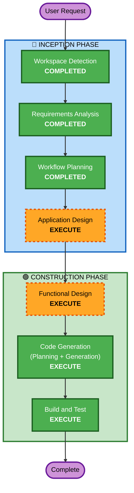

# Execution Plan

## Detailed Analysis Summary

### Change Impact Assessment
- **User-facing changes**: Yes — 고객 주문 UI + 관리자 대시보드 (실시간 메트릭 포함)
- **Structural changes**: Yes — 새 시스템 전체 설계 (Greenfield)
- **Data model changes**: Yes — 전체 데이터 모델 신규 설계
- **API changes**: Yes — REST API + SSE 엔드포인트 전체 신규
- **NFR impact**: Yes — 고성능 시연이 핵심 목표 (부하테스트)

### Risk Assessment
- **Risk Level**: Low (워크샵 데모, 유지보수 없음, 실패해도 재시작 가능)
- **Rollback Complexity**: Easy (Greenfield, 언제든 처음부터 재시작 가능)
- **Testing Complexity**: Simple (부하테스트 스크립트만, 단위테스트 최소)

---

## Workflow Visualization



### Text Alternative
```
Phase 1: INCEPTION
  - Workspace Detection (COMPLETED)
  - Requirements Analysis (COMPLETED)
  - Workflow Planning (COMPLETED)
  - Application Design (EXECUTE)

Phase 2: CONSTRUCTION
  - Functional Design (EXECUTE)
  - Code Generation (EXECUTE)
  - Build and Test (EXECUTE)
```

---

## Phases to Execute

### 🔵 INCEPTION PHASE
- [x] Workspace Detection (COMPLETED)
- [x] Requirements Analysis (COMPLETED)
- [x] Workflow Planning (IN PROGRESS)
- [ ] Application Design - **EXECUTE**
  - **Rationale**: 새 시스템이므로 컴포넌트 구조, API 엔드포인트, 데이터 모델을 한 번 정리해야 Code Generation이 효율적. 단, 하루 개발이므로 간결하게.

### 🟢 CONSTRUCTION PHASE
- [ ] Functional Design - **EXECUTE**
  - **Rationale**: 데이터 모델(테이블, 메뉴, 주문 등)과 비즈니스 로직(세션 관리, 주문 상태 전이)을 명확히 해야 코드 생성 품질 향상. 간결하게 수행.
- [ ] Code Generation - **EXECUTE** (ALWAYS)
  - **Rationale**: 실제 코드 생성. Planning + Generation 2단계.
- [ ] Build and Test - **EXECUTE** (ALWAYS)
  - **Rationale**: Docker Compose 실행 + 부하테스트 스크립트 실행 가이드.

### Skipped Stages

| Stage | Rationale |
|-------|-----------|
| Reverse Engineering | Greenfield — 기존 코드 없음 |
| User Stories | 단일 개발자 워크샵 프로젝트, 페르소나/스토리 불필요 |
| Units Generation | 단일 유닛으로 충분 (백엔드+프론트+DB를 하나로 관리) |
| NFR Requirements | 성능 요구사항이 이미 requirements에 명시됨. 별도 NFR 분석 불필요 |
| NFR Design | 별도 NFR 패턴 설계 불필요. 코드 생성 시 직접 반영 |
| Infrastructure Design | Docker Compose로 확정. 별도 인프라 설계 불필요 |
| Operations | Placeholder (미래 확장용) |

---

## Commit Strategy

코드 생성을 기능별로 나누어 커밋. 각 단계 완료 시 커밋 여부 확인.

```
docs: AIDLC design documents
chore: project setup (Docker Compose + initial structure)
feat: add backend API (Go + Gin + PostgreSQL)
feat: add customer order flow (menu → cart → order)
feat: add admin order monitoring with SSE
feat: add real-time metrics dashboard
feat: add load testing scripts (k6 + vegeta)
```

---

## Estimated Timeline

| Stage | 예상 소요 |
|-------|-----------|
| Application Design | 10분 (간결한 컴포넌트/API 정의) |
| Functional Design | 10분 (데이터 모델 + 비즈니스 로직) |
| Code Generation (Planning) | 5분 |
| Code Generation (Generation) | 30~45분 (전체 코드 생성, 기능별 커밋) |
| Build and Test | 10분 (Docker Compose + 부하테스트 가이드) |
| **Total** | **~1시간 15분** (AI 작업 시간) |

---

## Success Criteria
- **Primary Goal**: 워크샵에서 "있어보이는" 테이블오더 시스템 시연
- **Key Deliverables**:
  - Docker Compose로 한 번에 실행되는 전체 스택
  - 고객 주문 UI (메뉴 → 장바구니 → 주문)
  - 관리자 대시보드 (실시간 주문 + 메트릭 그래프)
  - 부하테스트 스크립트 (k6/vegeta)
  - 부하테스트 시 실시간 그래프 변화 시연
- **Quality Gates**:
  - docker-compose up으로 전체 시스템 기동
  - 고객 주문 플로우 정상 동작
  - 관리자 화면에서 실시간 주문 수신 확인
  - 부하테스트 실행 시 메트릭 대시보드 반응 확인
