# Execution Plan - 테이블오더 서비스

## Detailed Analysis Summary

### Change Impact Assessment
- **User-facing changes**: Yes — 고객용 주문 UI + 관리자 대시보드 전체 신규 구축
- **Structural changes**: Yes — 전체 시스템 아키텍처 신규 설계
- **Data model changes**: Yes — 전체 데이터베이스 스키마 신규 설계
- **API changes**: Yes — REST API 전체 신규 설계
- **NFR impact**: Yes — 실시간 통신(SSE), 멀티 매장 확장성, 동시 접속 처리

### Risk Assessment
- **Risk Level**: Medium (신규 프로젝트이므로 기존 시스템 영향 없음, 다만 복잡도 존재)
- **Rollback Complexity**: Easy (Greenfield - 기존 시스템 없음)
- **Testing Complexity**: Moderate (실시간 통신, 멀티 매장, 세션 관리 테스트 필요)

---

## Workflow Visualization

```mermaid
flowchart TD
    Start(["User Request"])
    
    subgraph INCEPTION["🔵 INCEPTION PHASE"]
        WD["Workspace Detection<br/><b>COMPLETED</b>"]
        RA["Requirements Analysis<br/><b>COMPLETED</b>"]
        US["User Stories<br/><b>COMPLETED</b>"]
        WP["Workflow Planning<br/><b>COMPLETED</b>"]
        AD["Application Design<br/><b>EXECUTE</b>"]
        UG["Units Generation<br/><b>EXECUTE</b>"]
    end
    
    subgraph CONSTRUCTION["🟢 CONSTRUCTION PHASE"]
        FD["Functional Design<br/><b>EXECUTE</b>"]
        NFRA["NFR Requirements<br/><b>EXECUTE</b>"]
        NFRD["NFR Design<br/><b>EXECUTE</b>"]
        ID["Infrastructure Design<br/><b>EXECUTE</b>"]
        CG["Code Generation<br/><b>EXECUTE</b>"]
        BT["Build and Test<br/><b>EXECUTE</b>"]
    end
    
    Start --> WD
    WD --> RA
    RA --> US
    US --> WP
    WP --> AD
    AD --> UG
    UG --> FD
    FD --> NFRA
    NFRA --> NFRD
    NFRD --> ID
    ID --> CG
    CG --> BT
    BT --> End(["Complete"])
    
    style WD fill:#4CAF50,stroke:#1B5E20,stroke-width:3px,color:#fff
    style RA fill:#4CAF50,stroke:#1B5E20,stroke-width:3px,color:#fff
    style US fill:#4CAF50,stroke:#1B5E20,stroke-width:3px,color:#fff
    style WP fill:#4CAF50,stroke:#1B5E20,stroke-width:3px,color:#fff
    style AD fill:#FFA726,stroke:#E65100,stroke-width:3px,stroke-dasharray: 5 5,color:#000
    style UG fill:#FFA726,stroke:#E65100,stroke-width:3px,stroke-dasharray: 5 5,color:#000
    style FD fill:#FFA726,stroke:#E65100,stroke-width:3px,stroke-dasharray: 5 5,color:#000
    style NFRA fill:#FFA726,stroke:#E65100,stroke-width:3px,stroke-dasharray: 5 5,color:#000
    style NFRD fill:#FFA726,stroke:#E65100,stroke-width:3px,stroke-dasharray: 5 5,color:#000
    style ID fill:#FFA726,stroke:#E65100,stroke-width:3px,stroke-dasharray: 5 5,color:#000
    style CG fill:#4CAF50,stroke:#1B5E20,stroke-width:3px,color:#fff
    style BT fill:#4CAF50,stroke:#1B5E20,stroke-width:3px,color:#fff
    style Start fill:#CE93D8,stroke:#6A1B9A,stroke-width:3px,color:#000
    style End fill:#CE93D8,stroke:#6A1B9A,stroke-width:3px,color:#000
    style INCEPTION fill:#BBDEFB,stroke:#1565C0,stroke-width:3px,color:#000
    style CONSTRUCTION fill:#C8E6C9,stroke:#2E7D32,stroke-width:3px,color:#000
    
    linkStyle default stroke:#333,stroke-width:2px
```



### Text Alternative
```
Phase 1: INCEPTION
- Workspace Detection (COMPLETED)
- Requirements Analysis (COMPLETED)
- User Stories (COMPLETED)
- Workflow Planning (COMPLETED)
- Application Design (EXECUTE)
- Units Generation (EXECUTE)

Phase 2: CONSTRUCTION (per-unit)
- Functional Design (EXECUTE)
- NFR Requirements (EXECUTE)
- NFR Design (EXECUTE)
- Infrastructure Design (EXECUTE)
- Code Generation (EXECUTE)
- Build and Test (EXECUTE)
```

---

## Phases to Execute

### 🔵 INCEPTION PHASE
- [x] Workspace Detection (COMPLETED)
- [x] Requirements Analysis (COMPLETED)
- [x] User Stories (COMPLETED)
- [x] Workflow Planning (COMPLETED)
- [ ] Application Design - **EXECUTE**
  - **Rationale**: 신규 시스템으로 컴포넌트 식별, 서비스 레이어 설계, 컴포넌트 간 의존성 정의 필요
- [ ] Units Generation - **EXECUTE**
  - **Rationale**: 멀티 레이어 시스템(Frontend 2개 + Backend + DB)으로 병렬 개발 가능한 단위 분해 필요

### 🟢 CONSTRUCTION PHASE (per-unit)
- [ ] Functional Design - **EXECUTE**
  - **Rationale**: 데이터 모델, 비즈니스 로직(세션 관리, 주문 상태 전이), API 설계 필요
- [ ] NFR Requirements - **EXECUTE**
  - **Rationale**: 실시간 통신(SSE), 동시 접속(100 테이블), 멀티 매장 확장성 요구사항 존재
- [ ] NFR Design - **EXECUTE**
  - **Rationale**: NFR 패턴(SSE 구현, 커넥션 풀링, 세션 관리) 설계 필요
- [ ] Infrastructure Design - **EXECUTE**
  - **Rationale**: AWS 배포 환경 설계 (EC2/ECS, RDS, 네트워킹) 필요
- [ ] Code Generation - **EXECUTE** (ALWAYS)
  - **Rationale**: 구현 계획 수립 및 코드 생성
- [ ] Build and Test - **EXECUTE** (ALWAYS)
  - **Rationale**: 빌드 및 테스트 지침 생성

### 🟡 OPERATIONS PHASE
- [ ] Operations - PLACEHOLDER

---

## Skipped Stages
- **Reverse Engineering** — Greenfield 프로젝트이므로 기존 코드 분석 불필요

---

## Success Criteria
- **Primary Goal**: 멀티 매장 테이블오더 서비스 MVP 구현
- **Key Deliverables**:
  - 고객용 React 웹 앱 (메뉴 조회, 장바구니, 주문)
  - 관리자용 React 웹 앱 (주문 모니터링, 테이블/메뉴 관리)
  - Node.js + Express REST API 서버
  - MySQL 데이터베이스 스키마
  - SSE 기반 실시간 주문 알림
- **Quality Gates**:
  - 모든 API 엔드포인트 정상 동작
  - SSE 실시간 알림 2초 이내 전달
  - 매장당 100개 테이블 동시 지원
  - JWT 인증 정상 동작
